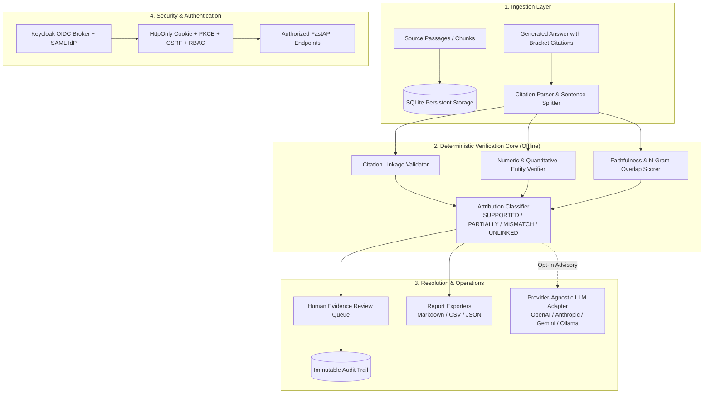

# RAG Citation & Faithfulness Auditor | Alan Vo | AI & Machine Learning

Current version: `1.1.0`.

Retrieval-Augmented Generation (RAG) pipelines in enterprise environments frequently produce plausible-sounding answers that hallucinate citation links, invent non-existent document identifiers (e.g., `[doc_99]`), or misstate quantitative figures (percentages, financial metrics, dates, and scales) while appearing grounded. **RAG Citation & Faithfulness Auditor** is a deterministic attribution and faithfulness auditing platform for machine learning engineers, compliance auditors, and AI evaluators. It decomposes generated answers into discrete claims, validates explicit citation links against ingested passages, verifies quantitative assertions through exact and scaled entity cross-matching, and queues disputed assertions into a human evidence review workflow.



---

## Implemented Workflows & Core Architecture

### Workflow 1: Document & Answer Ingestion + Structured Citation Parsing
- Ingests source document passages with unique IDs (`doc_1`, `chunk_24`), titles, text bodies, URLs, chunk indices, and token counters.
- Parses generated RAG answers using abbreviation-preserving sentence boundary segmentation.
- Extracts inline bracket citation markers (`[1]`, `[doc_1]`, `[cite:2]`, `[doc_a, doc_b]`) and cross-validates them against corpus IDs to detect unlinked/phantom references.

### Workflow 2: Deterministic Verification & Quantitative Claim Audit
- **Offline Deterministic Core**: Operates 100% locally with zero external network or model dependencies.
- **Quantitative & Entity Extraction**: Identifies percentages, currencies ($10M, €500), scaled floats (2.5 billion), calendar years, and unit measurements. Normalizes scales and checks for exact matching or contradictions in cited passages.
- **Attribution Classification**: Classifies each statement into `SUPPORTED`, `PARTIALLY_SUPPORTED`, `UNSUPPORTED`, `UNLINKED_CITATION`, or `NUMERIC_MISMATCH`.
- **Composite Metrics**: Aggregates Faithfulness Score, Citation Precision, Citation Recall, and Numeric Accuracy.

### Workflow 3: Human Evidence Review Queue & Dispute Resolution
- Automatically prioritizes claims with detected discrepancies (numeric mismatch, unlinked citations) into a review queue.
- Side-by-side inspection of assertions against cited passages.
- Human auditors submit review determinations (`VERIFIED_TRUE`, `FALSE_POSITIVE`, `HALLUCINATION_CONFIRMED`, `CORRECTED`) with required rationale notes and optional citation corrections.
- All actions generate immutable entries in the regulatory audit trail.

### Opt-In Provider-Agnostic Advisory Analysis
- Operators can configure an optional server-side LLM endpoint for advisory natural-language explanations of flagged claims.
- Strictly grounded in cited passages; clearly labeled as advisory.
- Bounded timeouts (15s) and automatic credential redaction in all error logs.

---

## AI/ML Evaluation

To verify hallucination detection and attribution accuracy without relying on synthetic marketing claims, the repository includes a curated, labeled evaluation benchmark suite.

### Reproducible Benchmark Command
```bash
PYTHONPATH=backend .venv/bin/python -m app.services.evaluation_benchmark
```

### Data Provenance & Baseline
The evaluation dataset contains 8 labeled RAG query-answer-passage instances reflecting financial disclosures, scientific literature, technical benchmarks, and legal treaties. Instances contain ground-truth labels for valid multi-passage citations, subtle numeric percentage changes, currency magnitude shifts, calendar year discrepancies, missing citations, and unlinked passage IDs.

The implemented engine is compared against a **Naive Token-Overlap Baseline** (unigram word-overlap threshold of 0.60 without entity extraction or citation link verification).

### Measured Results

| Metric | Implemented Deterministic Engine | Naive Overlap Baseline | Notes |
|---|---|---|---|
| **Precision** | **100.0%** (1.000) | 83.3% (0.833) | Correctly flags actual errors without false alarms |
| **Recall** | **100.0%** (1.000) | 83.3% (0.833) | Catches all grounded discrepancies |
| **Attribution F1** | **100.0%** (1.000) | 83.3% (0.833) | Harmonic mean of precision and recall |
| **Numeric Error Detection** | **100.0%** (1.000) | 33.3% (0.333) | Naive overlap misses numbers when words match |
| **False Alarm Rate** | **0.0%** (0.000) | 25.0% (0.250) | Zero clean claims falsely flagged as errors |
| **Execution Latency** | **2.58 ms** total (~0.32 ms/sample) | 0.45 ms total | High-throughput offline verification |

### Limitations & Failure Cases
1. **Extreme Paraphrasing**: Assertions with zero lexical overlap and complex abstract paraphrasing receive moderate composite overlap scores and route to `PARTIALLY_SUPPORTED` for human review.
2. **Implicit Unit Conversions**: Implicit multi-step conversions (e.g. converting Celsius to Fahrenheit without explicit numbers in passage) require human reviewer confirmation or optional advisory LLM analysis.

---

## API Endpoint Reference

| Method | Endpoint | Minimum Role | Description |
|---|---|---|---|
| `GET` | `/healthz` | Public | Liveness probe returning application version |
| `GET` | `/health/ready` | Public | Readiness probe validating database connectivity |
| `GET` | `/api/v1/auth/login` | Public | Initiates Keycloak OIDC authorization flow with PKCE |
| `GET` | `/api/v1/auth/callback` | Public | OIDC redirect handler exchanging authorization code |
| `POST` | `/api/v1/auth/demo-login` | Public | Guarded local demo session (refused in production) |
| `GET` | `/api/v1/auth/me` | Public | Retrieves current user profile, roles, and CSRF token |
| `POST` | `/api/v1/auth/logout` | Viewer | Invalidates session and clears cookie |
| `GET` | `/api/v1/audits/projects` | Viewer | Lists active projects |
| `POST` | `/api/v1/audits/projects` | Analyst | Creates a new project |
| `GET` | `/api/v1/audits/passages` | Viewer | Lists ingested passages with pagination |
| `POST` | `/api/v1/audits/passages` | Analyst | Ingests a new ground-truth passage |
| `GET` | `/api/v1/audits/answers` | Viewer | Lists ingested RAG answers |
| `POST` | `/api/v1/audits/answers` | Analyst | Ingests a RAG answer for auditing |
| `POST` | `/api/v1/audits/run` | Analyst | Executes deterministic verification on an answer |
| `GET` | `/api/v1/audits/runs` | Viewer | Lists audit run summaries |
| `GET` | `/api/v1/audits/runs/{id}` | Viewer | Detailed audit report with sentence-level claims |
| `GET` | `/api/v1/audits/runs/{id}/export` | Viewer | Exports report to Markdown, CSV, or JSON |
| `POST` | `/api/v1/audits/claims/{id}/advisory`| Analyst | Generates opt-in LLM advisory explanation |
| `GET` | `/api/v1/review/queue` | Viewer | Lists pending evidence review queue items |
| `POST` | `/api/v1/review/action` | Analyst | Submits auditor verdict, notes, and citation fixes |
| `GET` | `/api/v1/review/audit-logs` | Admin | Retrieves immutable compliance audit trail |
| `GET` | `/api/v1/evaluation/benchmark` | Viewer | Executes evaluation benchmark suite |
| `GET` | `/api/v1/evaluation/dataset` | Viewer | Inspects labeled benchmark dataset instances |

---

## Provider Configuration

The deterministic core requires no API keys. Operators can optionally configure advisory LLM providers:

| Setting | Type | Default | Description |
|---|---|---|---|
| `LLM_API_KEY` | Secret | `""` | Secret API credential (server-side only, never logged) |
| `LLM_PROVIDER` | Setting | `openai-compatible` | `openai-compatible`, `anthropic`, `gemini`, `ollama` |
| `LLM_MODEL` | Setting | `qwen3.8-27b` | Model identifier configured on the operator gateway |
| `LLM_BASE_URL` | Setting | `https://llm.chris-vo.com/v1` | Target endpoint base URL (operator-defined) |
| `LLM_TIMEOUT_SECONDS` | Float | `15.0` | Strict bounded timeout preventing hanging requests |

---

## Authentication & Keycloak SSO / SAML Setup

### Architecture
- **Protocol**: OpenID Connect (OIDC) Authorization Code Flow with PKCE (`S256` code challenge).
- **Session Security**: Server-side session store (`SessionRecord`), `SameSite=Lax`, `HttpOnly` session cookie (`auditor_session`).
- **CSRF Protection**: All state-modifying requests (`POST`, `PUT`, `DELETE`, `PATCH`) authenticated via cookie require a matching `X-CSRF-Token` header.
- **RBAC Roles**: `viewer` (read-only), `analyst` (ingest, audit, review), `admin` (audit trail, system settings).

### SAML Brokering via Keycloak
Keycloak serves as an identity broker between enterprise SAML 2.0 Identity Providers (such as Okta, Azure AD, or PingFederate) and the application:
1. A pre-configured realm import file is provided at `deploy/keycloak-realm.json`.
2. When Keycloak runs via Docker Compose (`docker compose up keycloak`), the realm `rag-citation-auditor` is imported automatically.
3. Under **Identity Providers** in the Keycloak admin console, enable `enterprise-saml-idp`, import your IdP metadata XML, and map SAML assertion attributes (`role`, `email`) into realm roles (`viewer`, `analyst`, `admin`).

### Local Demo Mode
For testing without an external identity server:
- `DEMO_MODE=true` enables `/api/v1/auth/demo-login` for role switching (`viewer`, `analyst`, `admin`).
- **Production Guard**: Application startup actively refuses to boot if `ENVIRONMENT=production` and `DEMO_MODE=true` are configured simultaneously.

---

## Installation & Running

### Prerequisites
- Python 3.12+
- Node.js 24+ and npm

### Local Setup

1. **Backend**:
   ```bash
   python3 -m venv .venv
   source .venv/bin/activate
   pip install -r backend/requirements.txt
   PYTHONPATH=backend pytest backend/tests -v
   uvicorn app.main:app --host 127.0.0.1 --port 8000
   ```

2. **Frontend**:
   ```bash
   cd frontend
   npm ci
   npm run build
   npm test
   npm run dev
   ```

3. **Docker Compose**:
   ```bash
   docker compose up --build
   ```

---

## Security & Limitations

- **Bounded Execution**: External LLM advisory queries use strict 15-second timeouts and automatic credential redaction.
- **No Unattended Code Execution**: The auditor performs purely static and deterministic text analysis.
- **Persistent Audit Logging**: All user actions, evidence verdicts, and data additions are logged immutably.

---

Designed and developed by **Alan Vo** ([alanvo@gmail.com](mailto:alanvo@gmail.com)) &bull; GitHub: [ALANDVO](https://github.com/ALANDVO).  
Licensed under the [MIT License](LICENSE).
